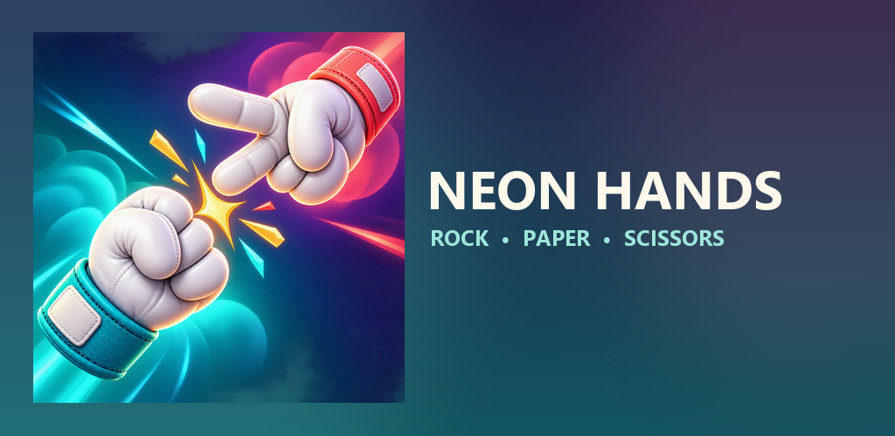
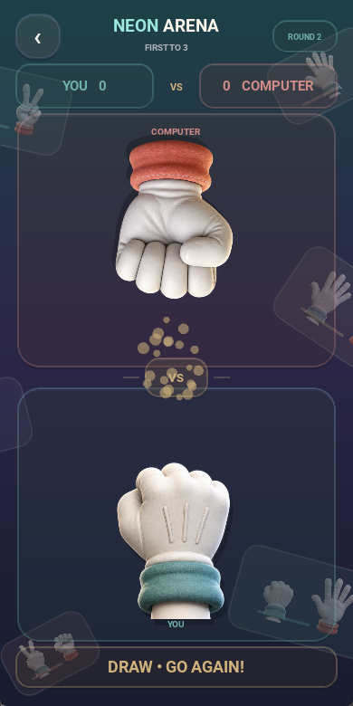
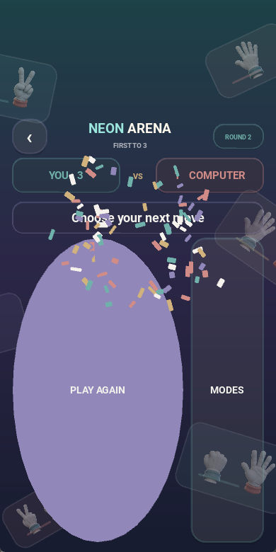

# Neon Hands — Rock Paper Scissors

<p align="center">
  
</p>

<p align="center">
  A colorful, offline Rock Paper Scissors game built with Python and Kivy.
</p>

Neon Hands turns the classic game into a polished mobile duel with expressive 3D gloves, physics-inspired motion, original music, responsive sound effects, and celebratory confetti. The player sees their teal glove from behind while the computer faces them with a coral glove.

## Highlights

- Single-round and first-to-three game modes
- Three-dimensional hand sprite atlases with cached texture regions
- Spring-and-damping motion for natural hand movement
- Animated menu, battle arena, particles, and victory confetti
- Separate music and sound-effect controls with local persistence
- Original menu, battle, click, movement, victory, and defeat audio
- Fully offline: no ads, accounts, analytics, tracking, or network permission
- SHA-256 integrity verification for packaged gameplay assets

## Screenshots

<p align="center">
  
  
</p>

## Run on desktop

Python 3.12 is recommended.

```powershell
py -3.12 -m venv .venv
.\.venv\Scripts\python.exe -m pip install -r requirements.txt
.\.venv\Scripts\python.exe main.py
```

## Tests and security checks

```powershell
.\.venv\Scripts\python.exe -m pip install -r requirements-dev.txt
.\.venv\Scripts\python.exe -m unittest discover -s tests -v
.\.venv\Scripts\python.exe tools\security_check.py
.\.venv\Scripts\bandit.exe -q -r main.py game_logic.py integrity.py
.\.venv\Scripts\pip-audit.exe -r requirements.txt
```

GitHub Actions runs unit tests, Ruff, Bandit, pip-audit, and the project policy scanner. CodeQL activates automatically when GitHub Code Scanning is available (public repositories or private repositories with GitHub Advanced Security). Runtime sprite and audio files are checked against the SHA-256 values in `assets/manifest.json` before the game starts.

## Android App Bundle

Android release builds require Linux or WSL:

```bash
python -m pip install "git+https://github.com/kivy/buildozer.git@a153097b3c534bea8a17da2abf1369d67c8cbfcb"
buildozer android release
```

The Buildozer configuration targets Android API 36 with NDK 28c, produces an AAB, requests no Android permissions, and disables application backup. Signing keys must remain outside the repository.

## Project structure

- `main.py` — interface, animation, lightweight physics, and audio management
- `game_logic.py` — pure and independently testable game rules
- `integrity.py` — runtime asset-integrity verification
- `assets/` — glove atlases, audio, splash screen, and app icons
- `store-assets/` — Play Store artwork, listing copy, and privacy policies
- `tests/` — game-rule and integrity-verification tests
- `tools/` — deterministic asset generation, security checks, and release packaging
- `.github/` — CI, CodeQL, Dependabot, and signed AAB workflows

## License

Source code, artwork, audio, and branding are distributed under the terms in `LICENSE`. A public GitHub repository exposes source code even when redistribution is legally restricted; use a private repository when source visibility is not intended.
